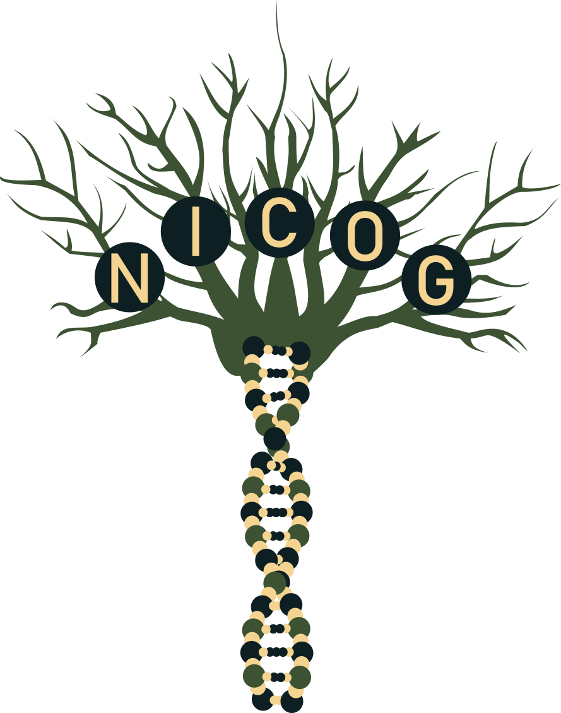

# NICOG - Nature Inspired Computing Optimization Group (NICOG)

The NICOG research group focuses on solving real-world problems using machine learning and optimisation techniques that take analogies from nature such as genetic algorithms and neural networks. The current focus areas of the group included:

- Evolutionary Computation
- Hyper-heuristics
- Automated design of machine learning and search techniques
- Deep Learning
- Neurevolution

Some of the application areas that we are working in include:
- Operations research - scheduling, packing and logistics problem.
- Health - disease diagnoses from images and quantitive data.
- Agriculture - identification of species, identification and prediction of diseases.
- Broadcasting - optimization, classification and prediction problems.
- Education - intelligent tutoring systems, learning analytics, learning tools, automated assessment.
- Natural Language Processing

## Current Members

### Staff

- [@Nelishia Pillay](https://cs.up.ac.za/cs/npillay/)
- [@Thambo Nyathi](https://cs.up.ac.za/cs/npillay/)

### Phd Students

- [@George Mweshi](https://cs.up.ac.za/cs/npillay/)
- [@Gisele Marais](https://cs.up.ac.za/cs/npillay/)

### Masters Students

- [@Darius Scheepers]()
- [@Jeffrey Russell]()
- [@Johan de Clercq]()
- [@Ethan Coryndon-Baker]()
- [@Tlou Lebelo]()

### MIT Students

- [@H. Jacobs]()

### Senior Research Assistants

- [@Gisele Marais]()

### Research Assistants

- [@Graeme Blain](https://github.com/GremBleen)
- [@Luke Nobrega](https://github.com/lukecn03)
- [@Aidan Chapman](https://github.com/u22738917)
- [@Vincent Feistel]()